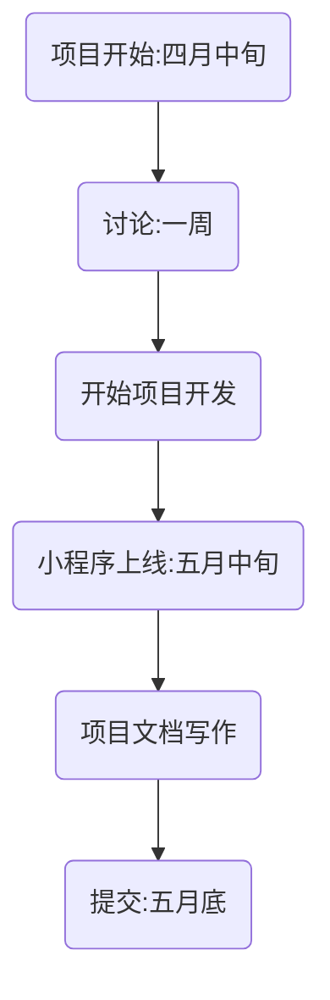
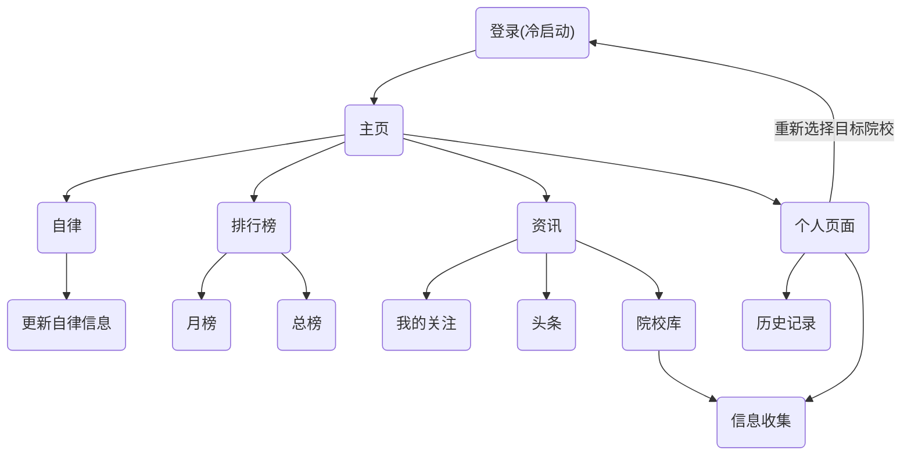
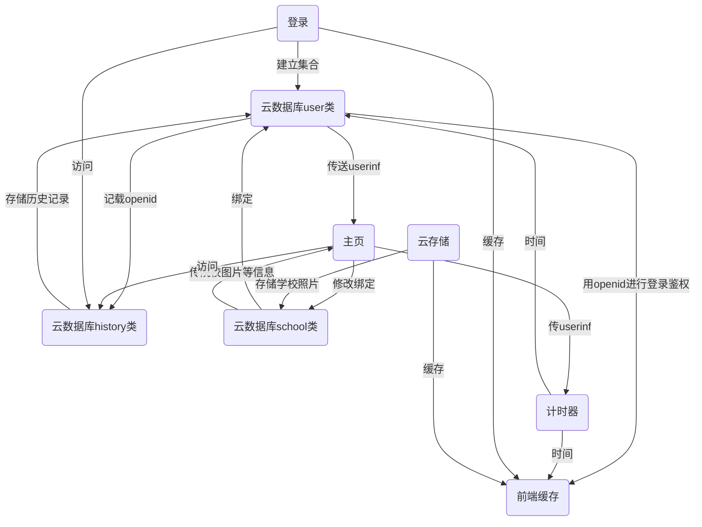

# 《毅研为定》开发文档

## 1 关于小程序

### 1.1 项目概要

&emsp;&emsp;本项目是一个面向考研升学的大学本科生的校园小程序，由个人目标、资讯推送，自律计时等模块构成，目的是给“考研党”乃至全体大学生提供一个方便易用，功能完善简介，界面美观，使用高校的微信小程序。

### 1.2 项目成员

&emsp;&emsp;本项目由来自不同地区的三所大学的四位同学组成，以下是队员简介：

&emsp;&emsp;队长：方陶松，来自大连理工大学软件学院，负责本项目的开发，文档写作等工作；

​		队员：柳鹏凯，来自天津大学智能与计算学部，负责本项目资讯模块的设计

&emsp;&emsp;队员：毕以镇，来自天津大学智能与计算学部，负责本项目的数据库设计；

​		队员：张然，来自中国科学院大学计算机学院，负责本项目资讯模块的设计；

### 1.3 开发周期

​		本项目开始于2021年四月中旬，历时约40天，以下是开发流程:

​		由于开发周期较短，我们的开发时间较为仓促，我们高度依赖**腾讯云云开发**和腾讯云云开发旗下的各种**云能力**及**云函数**建立后台，并以此进行小程序开发，最后实现了一套性能较高的后端架构。

## 2 需求分析

### 2.1 自律与计时

​		近年来，在铺天盖地的信息化浪潮下，学生尤其是大学生越来越无法离开手机和各类电子产品，不少学生因为沉迷手机，使得学业和生活遭受了很大的负面影响，而如何控制使用手机的时间，成为这个时代困扰学生的一个严峻的问题。为了解决这个问题，本项目应运而生。

​		本需求的灵感来A自一个自律软件，该软件可以在用户设定的市场内锁定手机，使得用户在一定时间内被动的戒断手机，该软件在各大应用平台的下载量较高，说明该软件较好的明确的信息时代学生自律学习的痛点，值得我们学习。

​		然而，这个软件依然具有局限性，如下：

- 该App的使用者至少被动的在特定时间内减少了使用手机，但并没有给用户培植一个主动放弃使用手机的内在习惯，简而言之，用户并没有因此变的更加自律。

- 由于锁定手机时不能再做其他的事情，而安卓系统的国产UI对用户权限管理混乱，所以，强制锁定可能给用户带来安全问题，譬如手机在锁定时因为无法使用社交软件导致发生意外的时候不能和其他人进行联络等。

- 缺少适合大学的内涵和文化，所以用户很难因此变得更加自律，而有可能产生依赖心理。

  因此，我们有必要对此做出改变，解决以上三个痛点，制作出一款**真正适合学生的自律软件**！

  我们的期望和目标如下：

- 优美的UI，符合大学生的审美；

- 可以以某种方式使得用户变得自律，实现作为一个青年的**社会责任**；

- 足够可靠的功能，简而言之，使得大学生可以“**用的上**”，“用得惯”。

### 2.2 资讯发布与推送

​		在以考研为代表的大学生的升学阶段，有“选择远大于努力”的说法，因为缺少相关的信息，而和其他竞争者产生较大的信息差，使得大学生无法适应考研这一激烈的竞争导致失利的比比皆是。因而，大学生的升学院校的资源获取问题亟待解决。

​		因此，为了解决这一问题，本项目计划设计一个资源收集，发布，和推送平台，我们的期望和目标如下：

- 收集关于考研和升学相关信息，包括但不限于各个院校的招生简章以及硕士生招生目录等，并且将其以院校和专业进行分类，并在**云开发云数据库**中存储；
- 将我们收集的资料以较为精确的方式推送给对报考学校有兴趣的用户，为了精准推送，我们计划在上线之后将用户的浏览数据聚类并作为训练集放在**腾讯智能钛机器学习（TI-ML）**平台中进行训练和建模并且使用**腾讯云的AI能力**开发出一套推荐算法，实现数据的精准投放。

## 3 系统设计

​		本小程序高度**依赖腾讯云云开发及基于云开发的各种云能力**，使得我们作为开发者可以胜任从前端到后端的全栈开发，较高的提升了效率。

### 3.1 前端页面设计

​		以上是我们用mermaid绘制的前端结构图

### 3.2 数据库设计

​		以上是我们用mermaid绘制的数据库结构图。后台分为**云存储**、**云函数**和**云数据库**三个部分：

​		云存储，我们将腾讯云云开发的云存储作为我们的图床，我们收集了全国所有一流高校的风景照片，并将其存进我们的云存储中，前端所有的icon等素材和封面背景图全部来自云存储，方便管理；

​		云函数，为了便于用户鉴权，以及更加安全可靠的操作云数据库，我们将所有和云数据库增删改查有关的函数全部封装进了云函数中，使得调用云数据库可以更加便捷；

​		云数据库，我们在云数据库中建立了三个集合，分别是存储用户信息的user类、存储学校的school类和存储文章浏览历史的history类。

​		以下是user类，由以下字段组成，存储了每个学生的信息：

​	出于对用户隐私的保护，我们并没有使用`wx.getuserprofile`函数获取所有的用户信息，而是只获取用户的_openid_，昵称和头像,_openid_是数据库的主键，是区分用户的字段，不可以缺省，昵称和头像用于个人页面和排行榜功能。_target_字段是冷启动时用户选择的目标院校，也可以在个人页面修改，*target*所存储的数据是用户理想中的心仪大学，主页，自律页面都会是该所大学的照片。

​		以下是school类：

​		校名是该集合的索引，因为大学不可能出现同名的现象，我们收集了每所学校的校训，将其存储在云数据库中，在自律界面也会广播该所学校的校训等文字，*sight*是一个数组，存储该院校在云存储的*cloudid*，方便访问。

​		以下是history类：

## 4 功能设计

		### 4.1计时

​		类似竞品软件，我们也开发了自律计时功能：

### 4.2 排行榜

### 4.3 咨询订阅和关注

### 4.4 个性化定制

## 5 软件测试

### 5.1 冷启动测试

​		我们模拟用户第一次进入小程序的系统测试，也就是冷启动。

​		首先，我们修改了user类中的集合，创建了一个新用户，然后清除开发者工具的缓存，使用小程序的功能，并且进行测试，将测试的日志打印在控制台中，以下是测试的结果：

​		可以看出，冷启动的表现较为优秀，使用的所有功能均没有报错，云存储和云数据库也进行了正常的访问和读写，本次测试较为成功。

### 5.2 服务器系统测试

​		在开发小程序的过程中，我们已经实现了对云数据库的访问均在云函数中进行，并且对所有的访问的操作均进行了封装，一定程度上减小了故障发生的可能性。

​		以下是云函数访问云数据库时的日志：

​		可以看出，所有云函数均可以正常执行访问云存储的操作，较为成功

### 5.3 前端系统测试

​		上图展示了微信开发者工具自带的性能测试。从图中可以看出，小程序在 ios 设备上的初启动耗时 1.8s，在 android 设备上的初启动耗时3.6s，网络请求的平均耗时为 0.5s，基本上渲染和响应时间能保持在 3s 以内，由于小程序的特性且不占用过多系统内存，符合当下基本的用户体验要求。

### 5.4 性能测试

​		

## 6 亮点和不足

### 6.1 亮点

​		本项目有如下亮点：

-  前端：本小程序界面新颖美观，界面简洁大气，我们认为在前端美工设计的角度达到了我们预期的目标。
-  数据库：由于开发周期较短，我们的开发时间较为仓促，我们高度依赖**腾讯云云开发**和腾讯云云开发旗下的各种**云能力**及**云函数**建立后台，并以此进行小程序开发，最后实现了一套性能较高的后端架构，而腾讯云卓越的稳定性和便捷性，也大大减轻了了我们数据库设计和维护的成本。
-  功能：功能简洁易用，当前版本的功能（自律计时，资讯获取，院校选择等）都是当代大学生较为需要的功能，我们对到目前为止的需求的实现情况较为满意，没有冗余和过于复杂的业务逻辑，是一个小而精的微信小程序。

### 6.2 不足

​		由于开发时间较为短暂，去除确定需求，美工制作，撰写文档的时间，用在程序设计上的时间则更加仓促。在开发中也暴露出我们部分的不足和值得进一步巩固和提高的地方：

- 前端界面的美观性可以进一步提高，使得界面的操作更加流畅。考虑考研学子的大部分学习时间在晚上，我们考虑给这个小程序适配夜间模式，以满足各个场景下的需求。
- 当前咨询功能是通过外嵌JavaScript文件显示的，并不利于后续版本的拓展和更新。
- 过于依赖封装的云函数对云数据库进行操作，不利于其他更加复杂的调用操作（云函数不能嵌套调用）		

## 7 未来展望

### 7.1 未来规划

​		以上是本项目的功能，亮点与不足，恳请老师批评指点。倘若本项目可以入围决赛并继续开发的话，我们将从以下几点进行优化：

- 设计推荐算法，我们将利用history集合存储用户的浏览历史等信息，并且将其进行聚类，作为训练集放在**腾讯智能钛机器学习（TI-ML）**平台中进行训练和建模并且使用**腾讯云的AI能力**开发出一套推荐算法，实现数据的精准投放。让所有用户都能够获取自己急需的考研升学相关的信息。
- 优化后台，我们将继续完善本小程序的**云能力**，使用基于**腾讯云云开发**的更多云能力，优化小程序的后台，在提升性能的同时增强数据库的可拓展性，实现效率和功能的统一。
- 完善功能，由于我们已经建立了一套较为复杂的数据库（见上文），应当在此基础上丰富前端的功能，我们考虑以大学为中心建立一套线上线下相结合的自律养成体系，提振高校学生自觉学习，自律生活的风气，实现我们作为一个大学生的社会责任。

### 7.2 学术及社会价值

​		在开发院校库这个功能的时候，我们曾经在网上寻找开源的院校相关的API接口，但是并没有找到较为满意的，所以我们打算自己做一个。在我们刻苦的工作下，终于完成了一个较为建议的基于云存储和云数据库的院校数据库，如果本项目有继续发展的空间，我们将考虑继续这个数据库完善，并且推出相关的API接口，向所有开发者提供一个简洁易用的**全国院校信息查询系统**接口，同时，我们将利用**腾讯云的AI能力**对接口的数据进行建模并分析，将其作为中国高校考研舆情分析的一部分，并将结果以论文的形式发布出来，这就是本项目的学术价值。

​		自律是人最重要的品格之一，如果作为一个大学生还要依靠别人的督促或者是锁手机软件进行学习，很难在一个完全依靠自己的陌生环境较好的生活和发展，我们开发运营本小程序，最主要的目的是想让身边的“考研党”们乃至全国的大学生在紧张的备考中养成自律自我约束的学习习惯，继而培养自立自强的品格，从而有助于在全国高校中培养一种自律进取，求实创新的氛围，因而，本项目也有较高的**社会价值**。

