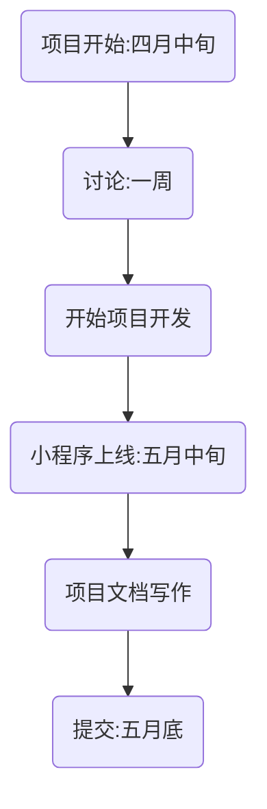
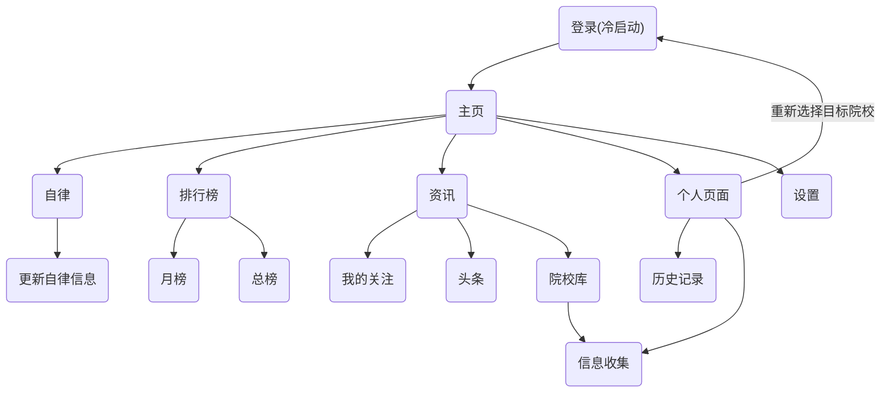
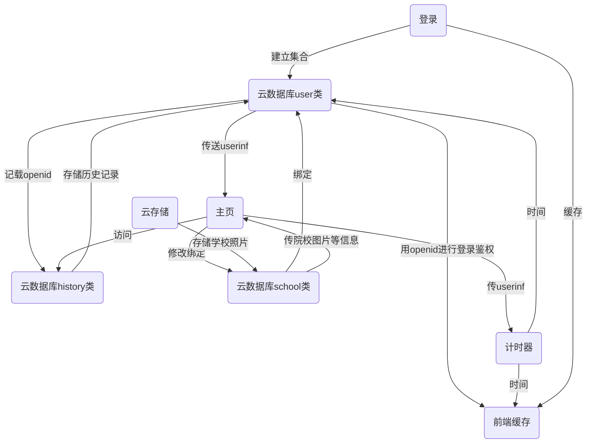

# 《毅研为定》开发文档

[TOC]

## 1 关于小程序

### 1.1 项目概要

&emsp;&emsp;本项目是一个面向考研升学的大学本科生的校园小程序，由个人目标、资讯推送，自律计时等模块构成，目的是给“考研党”乃至全体大学生提供一个方便易用，功能完善简介，界面美观，使用高校的微信小程序。开发周期两个月，代码行数10,000行以上。

​		目前，本小程序已经通过审核正式上线，并且有条不紊的进行版本迭代。

### 1.2 关于appid的声明和承诺

​		**本小程序开发于2021年4月之后**（包括但不限于创建小程序，配置云环境，使用云存储等和本项目直接或间接相关的工作均在2021年四月之后），但本小程序所用的的appid注册于2020年8月之前（本团队之前的邮箱绑定了其他微信公众平台，不能再注册其他appid。），故本appid的创建时间不能代表开发周期。特此承诺。

​	**承诺人：Topologian**

### 1.3 项目成员

&emsp;&emsp;本项目由来自不同地区的三所大学的四位同学组成，以下是队员简介：

		队长：Topologian，来自A大学软件学院，负责本项目的开发，文档写作等工作；

		队员：2U，来自B大学智能与计算学部，负责本项目资讯模块的设计

		队员：Nick，来自B大学智能与计算学部，负责本项目的数据库设计；Rena

		队员：Rena，来自C大学计算机学院，负责本项目资讯模块的设计；

### 1.4 开发周期

​		本项目开始于2021年四月中旬，历时约40天，以下是开发流程:

​		由于开发周期较短，我们的开发时间较为仓促，我们高度依赖**腾讯云云开发**和腾讯云云开发旗下的各种**云能力**及**云函数**建立后台，并以此进行小程序开发，最后实现了一套性能较高的后端架构。

## 2 需求分析

### 2.1 自律与计时

​		近年来，在铺天盖地的信息化浪潮下，学生尤其是大学生越来越无法离开手机和各类电子产品，不少学生因为沉迷手机，使得学业和生活遭受了很大的负面影响，而如何控制使用手机的时间，成为这个时代困扰学生的一个严峻的问题。为了解决这个问题，本项目应运而生。

​		本需求的灵感来A自一个自律软件，该软件可以在用户设定的市场内锁定手机，使得用户在一定时间内被动的戒断手机，该软件在各大应用平台的下载量较高，说明该软件较好的明确的信息时代学生自律学习的痛点，值得我们学习。

​		然而，这个软件依然具有局限性，如下：

- 该App的使用者至少被动的在特定时间内减少了使用手机，但并没有给用户培植一个主动放弃使用手机的内在习惯，简而言之，用户并没有因此变的更加自律。

- 由于锁定手机时不能再做其他的事情，而安卓系统的国产UI对用户权限管理混乱，所以，强制锁定可能给用户带来安全问题，譬如手机在锁定时因为无法使用社交软件导致发生意外的时候不能和其他人进行联络等。

- 缺少适合大学的内涵和文化，所以用户很难因此变得更加自律，而有可能产生依赖心理。

  因此，我们有必要对此做出改变，解决以上三个痛点，制作出一款**真正适合学生的自律软件**！

  我们的期望和目标如下：

- 优美的UI，符合大学生的审美；

- 可以以某种方式使得用户变得自律，实现作为一个青年的**社会责任**；

- 足够可靠的功能，简而言之，使得大学生可以“**用的上**”，“用得惯”。

### 2.2 资讯发布与推送

​		在以考研为代表的大学生的升学阶段，有“选择远大于努力”的说法，因为缺少相关的信息，而和其他竞争者产生较大的信息差，使得大学生无法适应考研这一激烈的竞争导致失利的比比皆是。因而，大学生的升学院校的资源获取问题亟待解决。

​		因此，为了解决这一问题，本项目计划设计一个资源收集，发布，和推送平台，我们的期望和目标如下：

- 收集关于考研和升学相关信息，包括但不限于各个院校的招生简章以及硕士生招生目录等，并且将其以院校和专业进行分类，并在**云开发云数据库**中存储；
- 将我们收集的资料以较为精确的方式推送给对报考学校有兴趣的用户，为了精准推送，我们计划在上线之后将用户的浏览数据聚类并作为训练集放在**腾讯智能钛机器学习（TI-ML）**平台中进行训练和建模并且使用**腾讯云的AI能力**开发出一套推荐算法，实现数据的精准投放。

## 3 系统设计

​		本小程序高度**依赖腾讯云云开发及基于云开发的各种云能力**，使得我们作为开发者可以胜任从前端到后端的全栈开发，较高的提升了效率。

### 3.1 前端页面设计

​		以上是我们用mermaid绘制的前端结构图

### 3.2 数据库设计

​		以上是我们用mermaid绘制的数据库结构图。后台分为**云存储**、**云函数**和**云数据库**三个部分：

​		云存储，我们将腾讯云云开发的云存储作为我们的图床，我们收集了全国所有一流高校的风景照片，并将其存进我们的云存储中，前端所有的icon等素材和封面背景图全部来自云存储，方便管理；

​		云函数，为了便于用户鉴权，以及更加安全可靠的操作云数据库，我们将所有和云数据库增删改查有关的函数全部封装进了云函数中，使得调用云数据库可以更加便捷；

​		云数据库，我们在云数据库中建立了三个集合，分别是存储用户信息的user类、存储学校的school类和存储文章浏览历史的history类。

​		以下是user类，由以下字段组成，存储了每个学生的信息：

​	出于对用户隐私的保护，我们并没有使用`wx.getuserprofile`函数获取所有的用户信息，而是只获取用户的_openid_，昵称和头像,_openid_是数据库的主码，是区分用户的字段，不可以缺省，昵称和头像用于个人页面和排行榜功能。_target_字段是冷启动时用户选择的目标院校，也可以在个人页面修改，*target*所存储的数据是用户理想中的心仪大学，主页，自律页面都会是该所大学的照片。

​		以下是school类：

​		校名是该集合的索引，因为大学不可能出现同名的现象，我们收集了每所学校的校训，将其存储在云数据库中，在自律界面也会广播该所学校的校训等文字，*sight*是一个数组，存储该院校在云存储的*cloudid*，方便访问。

​		以下是history类：

## 4 功能设计

​		这是我们的功能模块图：（截止当前版本，只呈现所有已实现的功能）

### 4.1 登录

​		这是新用户第一次进入时的界面，用户可以在这里选择自己想要报考的院校，同时也可以看到关于调用权限和选择院校的信息，我们将获取用户的头像和账户标识进行自律程度的排序，并且承诺不会将您的信息用在本小程序之外的地方。

    

### 4.2 选择院校

​		用户可以在第一次使用小程序时使用选择院校的功能，也可以在“个人”界面中更改已经选择的院校：

    

​		我们将在云数据库中的user类存储用户已经选择的学校，并且根据学校对用户进行个性化推荐和定制服务，例如计时器界面的背景图片，主页的logo和校训等，在潜移默化中坚定同学努力奋斗，拼搏考研的信心和意志力，根据心理学中的*Ideomotor*效应（心理暗示）效应，这将有助于对用户产生积极的影响。心理暗示的作用是巨大的，不但能影响人的心理与行为，还能影响到人体的生理机能。因此，积极的暗示能起到增进和改善的作用。所以还是要有积极的心理暗示，这样对于考研的帮助是巨大的。

### 4.3 自律计时

   

​		自律计时是我们的核心功能之一，同学可以在自律界面记录自己的自律市场（在息屏状态下计时器timer依然可用），可以记录用户不使用手机的时长，在计时过程中用户可以随时重新计时或者终止计时，同时计时的结果会上传到user类中，不用担心时长没有被记录，较为便捷，同时，用户可以在设置界面选择计时器上方浮动的文字的种类（该院校的校训或者是一个励志语录api），用户也可以打开倒计时模式，设定本次的自律市场，计时器timer在倒计时结束之后计时会自动停止，系统会弹窗提示用户要注意休息，劳逸结合。

### 4.4 排行榜

​		以上是我们开发的排行榜功能：

​		排行榜记录用户记录的总时长，分为月榜和年榜两个部分，用户可以在上面找到自己的头像，昵称，自律时长以及在排行榜中的位置，同时，为了严格保护用户的隐私安全，我们允许用户隐藏自己的昵称和头像，但可以选择显示自律时长，同学们在比对中可以看见自己好友的自律时长，知道自己身边的人还在为了同一个目标而不懈奋斗，从而坚定继续学习的决心和自觉，这也是*Ideomotor*效应所证明的，我们致力于在全国高校的考研党中营造一种积极向上，矢志不渝的健康氛围，这也正是我们超越竞品的信心和凭借之一。

### 4.4 资讯

​		以上是我们开发的资讯界面。

​		我们开发出了一套简介大气的显示模板，可以显示我们收集和选取的包括**招生简章**和院校新闻在内的和高校研究生招生密切相关的文章，并且以内嵌JavaScript的形势在前端呈现，同时，我们开通了**关注**，**收藏**和**浏览历史**功能，使得用户在浏览文章的同时，可以记录用户的浏览历史，当用户需要重新获取该篇文章的信息时，可以通过浏览和收藏界面找到自己看过的文章。同时我们开通了关注功能，用户可以选择性的收到来自自己心仪的目标院校的招生简章和相关新闻的精确推送，体现了信息推送了精确性和及时性。

​		目前，毅研为定平台已经更新文章近百篇，并且收获了较高的浏览量和关注度，这也和我们较为细致美观的美工和严谨完善的业务逻辑分不开。

​		在未来，我们将利用history集合存储用户的浏览历史等信息，并且将其进行聚类，作为训练集放在**腾讯智能钛机器学习（TI-ML）**平台中进行训练和建模并且使用**腾讯云的AI能力**开发出一套推荐算法，实现数据的精准投放。让所有用户都能够获取自己急需的考研升学相关的信息。

### 4.5 个人界面

​		以上是我们开发的个人界面。

​		我们使用微信开放的open-data接口，使得免于授权就可以调用用户的昵称和头像（我们不会收集未经授权的头像和昵称等信息），背景是用户设定的目标院校，图片在每次刷新页面都会随机更换，防止用户产生审美疲劳。

​		在这里，我们调用了微信小程序的反馈和联系开发者接口，使得用户可以随时向微信官方以及小程序的开发者反馈小程序的bug。我们也收集了用户的浏览历史，使得用户可以看见自己曾经浏览过的资讯。用户也可以在个人页面重新访问和修改自己的目标，找到更加适合自己的院校。为了号召其他志趣相投的开发者一起建设考研党自信自律的心态和品格，我们将这个项目的代码进行了开源，网址是：https://github.com/fangtaosong/perseverance。这就是我们的毅研为定！也是我作为一个未来的考研党对命运的顽强抗争和对前路的不断求索！

## 5 软件测试

### 5.1 冷启动测试

​		我们模拟用户第一次进入小程序的系统测试，也就是冷启动。

​		首先，我们修改了user类中的集合，创建了一个新用户，然后清除开发者工具的缓存，使用小程序的功能，并且进行测试，将测试的日志打印在控制台中，以下是测试的结果：

​		我们反复删除缓存并重启小程序，这是控制台打印的调试结果，可以看出，冷启动的表现较为优秀，使用的所有功能均没有报错，云存储和云数据库也进行了正常的访问和读写，本次测试较为成功。

### 5.2 服务器系统测试

​		在开发小程序的过程中，我们已经实现了对云数据库的访问均在云函数中进行，并且对所有的访问的操作均进行了封装，一定程度上减小了故障发生的可能性。

​		以下是云函数访问云数据库时的日志：

​		可以看出，所有云函数均可以正常执行访问云存储的操作，较为成功。

### 5.3 前端系统测试

​		上图展示了微信开发者工具自带的性能测试。从图中可以看出，小程序在 ios 设备上的初启动耗时 0.9s，在 android 设备上的初启动耗时1.5s，网络请求的平均耗时为 0.15s，基本上渲染和响应时间能保持在 1.5 以内，由于小程序的特性且不占用过多系统内存（405吗），符合当下基本的用户体验要求。

### 5.4 性能测试

​		这是我们用微信web开发者工具所作的微信小程序体验评分：无论是从页面渲染、网络、JS脚本等方面评估小程序的性能，还是从视觉、交互等方面评估小程序的体验是否足够好，我们都较为优异的通过了考验，这也是我们严格遵守开发规范的结果。

## 6 运营方案

### 6.1 引流策略

​		在平台建立之初，能否获取首批用户是重中之重，为此构建了如下引流策略：

- 我们会利用表白墙，联系学生会权益部，宣传这个小程序，尽可能多的让这个小程序为人所熟知，尽快积累第一批用户。
- 社群分享。这个小程序以分享的形式在微信群和考研交流群中流传，由于群里都是身边熟悉的同学和学长学姐，信任度较高，更容易地让用户点击与关注这个小程序；
- 公众号推广。平台将会建立自己的微信公众号“毅研为定”，由专业人士定期撰写发布使用心得，发布推文向大家介绍小程序的使用方法和自信自律的重要性，号召大家一起自律，减少使用手机，扩大小程序的用户群体

### 6.2 存留策略

​		在吸引用户后，针对如何通过满足客户的需求，使用户继续访问平台更多的页面、增加在平台上的停留时间以及未来的再次使用，构建如下存留策略：

- 打铁还需自身硬，不断迭代，推出更多更适合学生的功能和模块，建设一个更加美观，功能更加完善的小程序。
- 增加更多的文章，扩充院校库。
- 内嵌更多的js，使得资讯界面更加充实。

### 6.3 转化策略

​		用户存留不是最终目的，如何将用户转化才是关键。为了刺激用户转化，构建如下转化策略：

- 设立奖励策略，对在排行耪最前列的用户进行一定程度的奖励，以鼓励更多的考研党使用本小程序，获取足够的高校研究生院的招生信息，同时让大家变得更加自律。
- 此时，我们应该已经拥有了足够规模的用户群体，我们会使用我们积累的数据进行大数据的数学建模，在**腾讯智能钛机器学习（TI-ML）**平台中进行训练和建模并且使用**腾讯云的AI能力**开发出一套推荐算法，实现数据的精准投放。

### 6.4 优化策略

​		在运营一段时间后，对相关数据进行分析总结，对运营策略发现如下可调整优化的方面：

- 成立粉丝群，建立社区生态，建立较为稳固的粉丝群体。
- 应用推荐算法，推出精准推送的功能。
- 优化服务回报。分析运营数据，统计各项服务的投入产出比，找出回报大的投入方向。对于低回报的服务进行优化，如果优化后效果不好，减少成本或者放弃；

## 7 亮点和不足

### 7.1 亮点

​		本项目有如下亮点：

-  前端：本小程序界面新颖美观，界面简洁大气，我们认为在前端美工设计的角度达到了我们预期的目标。
-  数据库：由于开发周期较短，我们的开发时间较为仓促，我们高度依赖**腾讯云云开发**和腾讯云云开发旗下的各种**云能力**及**云函数**建立后台，并以此进行小程序开发，最后实现了一套性能较高的后端架构，而腾讯云卓越的稳定性和便捷性，也大大减轻了了我们数据库设计和维护的成本。
-  功能：功能简洁易用，当前版本的功能（自律计时，资讯获取，院校选择等）都是当代大学生较为需要的功能，我们对到目前为止的需求的实现情况较为满意，没有冗余和过于复杂的业务逻辑，是一个小而精的微信小程序。

### 7.2 不足

​		由于开发时间较为短暂，去除确定需求，美工制作，撰写文档的时间，用在程序设计上的时间则更加仓促。在开发中也暴露出我们部分的不足和值得进一步巩固和提高的地方：

- 前端界面的美观性可以进一步提高，尝试使用其他UI，或者聘请专门的美工。
- 后台架构应该继续优化，目前出现了数据库读取缓慢的问题，可能是由于购买的云开发资源不足。		

## 8 未来展望

### 8.1 未来规划

​		以上是本项目的功能，亮点与不足，恳请老师批评指点。倘若本项目可以入围决赛并继续开发的话，我们将从以下几点进行优化：

- 设计推荐算法，我们将利用history集合存储用户的浏览历史等信息，并且将其进行聚类，作为训练集放在**腾讯智能钛机器学习（TI-ML）**平台中进行训练和建模并且使用**腾讯云的AI能力**开发出一套推荐算法，实现数据的精准投放。让所有用户都能够获取自己急需的考研升学相关的信息。
- 优化后台，我们将继续完善本小程序的**云能力**，使用基于**腾讯云云开发**的更多云能力，优化小程序的后台，在提升性能的同时增强数据库的可拓展性，实现效率和功能的统一。
- 完善功能，由于我们已经建立了一套较为复杂的数据库（见上文），应当在此基础上丰富前端的功能，我们考虑以大学为中心建立一套线上线下相结合的自律养成体系，提振高校学生自觉学习，自律生活的风气，实现我们作为一个大学生的社会责任。

### 8.2 学术及社会价值

​		在开发院校库这个功能的时候，我们曾经在网上寻找开源的院校相关的API接口，但是并没有找到较为满意的，所以我们打算自己做一个。在我们刻苦的工作下，终于完成了一个较为建议的基于云存储和云数据库的院校数据库，如果本项目有继续发展的空间，我们将考虑继续这个数据库完善，并且推出相关的API接口，向所有开发者提供一个简洁易用的**全国院校信息查询系统**接口，同时，我们将利用**腾讯云的AI能力**对接口的数据进行建模并分析，将其作为中国高校考研舆情分析的一部分，并将结果以论文的形式发布出来，这就是本项目的学术价值。

​		自律是人最重要的品格之一，如果作为一个大学生还要依靠别人的督促或者是锁手机软件进行学习，很难在一个完全依靠自己的陌生环境较好的生活和发展，我们开发运营本小程序，最主要的目的是想让身边的“考研党”们乃至全国的大学生在紧张的备考中养成自律自我约束的学习习惯，继而培养自立自强的品格。因而，本项目也有较高的**社会价值**。

## 9 写在最后——开发者的话

**开发者2U：**

​		“毅研为定”是一款为考研的同学量身打造，能够提供考研资讯信息，利用专注功能提高复习效率的小程序。小程序的开发历时两个月，没有什么比赛经验的我们凑到一起，开始进行小程序开发的学习与设计，我们从基本的页面开始搭建，从初步设计一些简单的功能，到迭代完善出更实用、人性化的功能。为了尽可能满足考研同学的需求，不断优化小程序的使用体验，开发团队的成员想用自己的努力，通过设计这样一款小程序，来提高同学们的学习效率与专注度，为奋战考研的小伙伴们提供一些获取信息的途径，并尽可能为同学们带来一些便利，帮助同学们顺利上岸，去往自己心仪的高校。

**开发者Nick：**

​		专注是走向成功的一个重要因素。尤其是在考研准备过程当中，许多事实表明，经常在复习过程中玩手机的人大多最后成绩都不理想，我们的小程序可以帮助你集中注意力复习，减少开小差的时间。同时还能帮助你更高效的利用时间，取得事半功倍的效果。我们小程序也能为你提供最新的咨询，避免错过一些高校发布的重要信息。考研需要良师益友，**毅研为定将会是你在准备考研过程中的最好的“益友”**，提醒你时时刻刻专注于自己的考研目标，帮助你顺利上岸。

**开发者Rena：**

​		MIT在逃大学生团队已经成立两个月啦，距离我们决定开始做《毅研为定》小程序也已经过去两个月了。两个月的时间匆匆又漫长，我们从零开始搭建了目前实现丰富功能的小程序，我们也随着小程序的迭代更新一起成长。开发过程中伴随着繁忙的课程，密集的考试，复杂的大作业，丰富的讲座，接踵而至的DDL，但我们还是挤出时间在组长的带领下一次次地开会讨论，确定下一步的方向，互相支持，互相理解，互相鼓励，坚持到了最后。**放弃确实不难，但坚持一定很酷**，我们小程序的初心也是帮助同学们养成自律的好习惯，为同学们带来尽可能丰富的考研资讯。星光不问赶路人，时光不负有心人，我们团队衷心地祝愿每一位考研人都能如愿以偿地进入自己理想的学府，也欢迎同学们对我们的小程序提出宝贵的意见和建议。

**开发者topologian:**

​		今天是2021年5月31号，星期一。至此，我完成了这个小程序提交版本全部内容——一个代码量不低又很美观的微信小程序。虽然还有一点小小的瑕疵，但总归是完成了。就像看着自己孩子慢慢长大的父母一样，欣慰又喜悦。

​		从自己设计的结构和自己选的icon，一个好看美观的软件，虽然说起来就是一句话的事情，但是实现起来真的好难啊。即使花了很多时间可，依然没有尽善尽美。可能还是我的编程水平和web基础还不够。

​		即便如此，这次程序开发仍然存在许许多多的不如意之处，比如bug依然没有消除，字体导入失败，样式表冗余等等。

​		现在是2021年5月31凌晨两点，相信其他人此时此刻应该和这个世界一起睡了，我的电脑电量也所剩无几，但是我作为一个喜欢码字的软件工程学生，仍然想从我自己的角度对这个项目做一个总结。

​		在这个“艰难”（起码我这么认为）的项目中，我得出了三点教训：

​		第一：从实际角度说，函数和全局变量的命名一定要小心谨慎，在统合项目各部分的代码时，我发现一个较为严重的问题，变量往往叫blog，na等等，这就让我在整理时有了不少麻烦，正如一个个零件和一个功能完备的系统，零件的精良固然重要，但是如果每个零件都是一个模子刻出来的，那这个系统也很难成为一个整体，无法达到1+1大于2的效果；

​		第二：我曾经在项目开始的时候立下豪言壮语，一定要设计一个最最最最最好的小程序，但是，实际的结果总是大相径庭，我被埋没于数不胜数的各式各样的社团活动之中，显然难以全身心的投入其中，悔不当初，但是这个失败也让我懂得了临渊羡鱼，不如退而结网，与其在那苦苦巴望着他人辉煌的成功，不如自己脚踏实地的努力提升自己的代码能力，仅仅呼喊着口号却拿不出一些与此对应的行动绝对不可能取得任何成绩。不过最后，我还是克服了重重阻碍，将它尽善尽美地完成了。

​		第三：时间分配尤为重要，我事先没有构思，也没有对查阅的代码做一些微调，更没有尝试将代码在开始构架的时候将整个页面的想法统合起来，导致最终交作品的时候我手忙脚乱，问题多多。

​		行文至此，现在已经两点半了，明天上午还要把本文档上交，无论结果如何，是喜是悲，无论评委们会不会看到这里，我认为其实没有那么重要，文档其实是写给自己看的，我的代码也是一样，即使没有人愿意看，没有人愿意拿这个小程序培养自律的习惯，这些data和code也会安静的躺在磁盘扇区的某个角落，虽然不被重视，虽然没有人会知道开发者的名字，但是代码背后所折射出的思想的力量与光辉却永远骄傲的闪耀在天地之间！

​		祝全球疫情早日结束，世界早日恢复正常的秩序。

